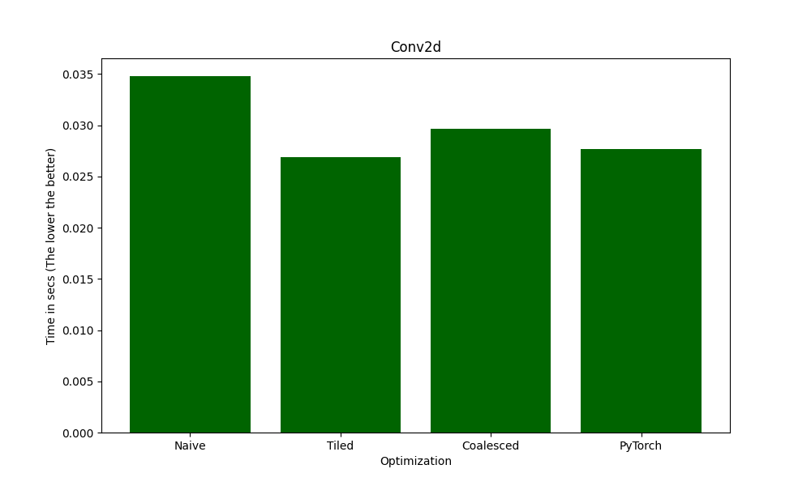
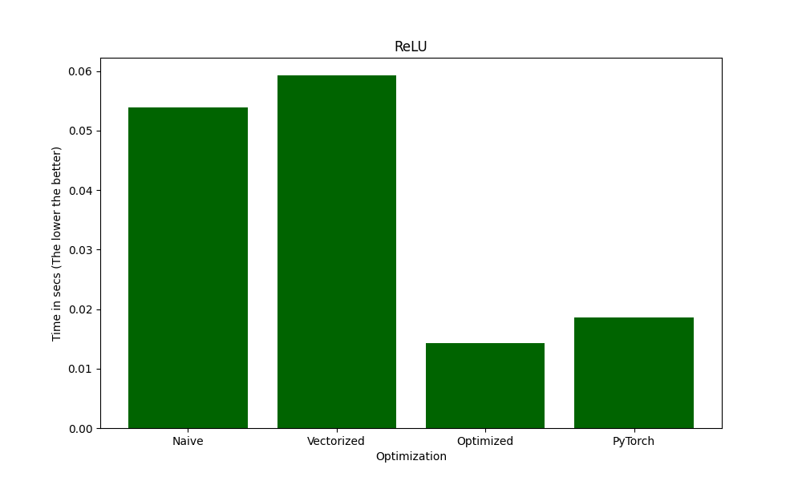

# KernelLab

**High-Performance CUDA and Triton Kernels for Deep Learning & HPC**

## About KernelLab

KernelLab is a collection of highly optimized CUDA and Triton kernels designed for deep learning, high-performance computing (HPC), and general-purpose GPU acceleration. Each kernel includes multiple levels of optimization—from naïve implementations to shared memory, warp-level, vectorized, and tensor-core optimized versions.

---

## Features

- Optimized CUDA and Triton kernels for deep learning, matrix operations, and image processing.
- Multiple optimization techniques: Shared Memory, Coalesced Memory Access, Warp-Level Parallelism, Tensor Cores.
- Benchmark comparisons against cuBLAS, cuDNN, and PyTorch CUDA kernels.
- Currently Optimized for Ampere architecture.

---

## Implemented Kernels & Optimizations

### CUDA Kernels

#### Convolution Kernels

- **2D Convolution (Conv2D)**
  - Naïve (Direct element-wise computation)
  - Tiled Shared Memory (Minimizing global memory access)
  - Memory Coalescing (Optimized memory access patterns)
  - Tensor Cores (Using WMMA for fused matrix multiplications)
- **3D Convolution (Conv3D)**
  - Naïve
  - Shared Memory (Minimizing redundant loads)
  - Tiled (Reducing register pressure)
  - Register Blocking (Efficient memory reuse via registers)

#### Matrix & Reduction Operations

- **Matrix Transpose**
  - Naïve (Direct row-column swaps)
  - Shared Memory Tiling (Blocking memory accesses for fewer global loads)
  - Memory Coalescing (Optimizing global memory writes for aligned access)
- **Matrix Multiplication (GEMM)**
  - Naïve (Row-major computation)
  - Tiled (Using shared memory for efficient blocking)
  - Register Blocking (Reducing register pressure & maximizing reuse)
  - Warp-Level Tiling (Optimizing warp-level data exchange)
  - Tensor Cores with WMMA (Using NVIDIA Tensor Cores for fused matrix ops)
- **Reduction Sum**
  - Naïve (Basic sequential reduction per thread block)
  - Branchless Reduction (Avoiding thread divergence for performance gain)
  - Warp-Level Reduction (Using shuffle intrinsics for direct register exchange)
- **Reduction Max**
  - Naïve (Basic sequential reduction per thread block)
  - Vectorized Reduction (Using float4 for vectorized reduction)
  - Warp-Level Reduction (Using shuffle intrinsics for direct register exchange)

#### Element-wise & Activation Functions

- **ReLU Activation**
  - Naïve (Basic element-wise ReLU application)
  - Coalesced Memory Access (Optimized read/write for better bandwidth usage)
  - Vectorized Execution (Processing multiple elements per thread using vector types like `float4`)
- **SoftMax Function**
  - Naïve (Computing exponentials & normalizing sequentially)
  - Shared Memory Optimization (Avoiding redundant memory accesses)
  - Block Tiling (Parallelizing exponentiation & normalization)
  - Warp-Level Reduction (Efficient sum-reduction across warps)
  - State-of-the-Art Optimization (Optimized numerical stability & memory efficiency)
- **Vector Addition**
  - Naïve (Thread-per-element)
  - Shared Memory Optimization (Minimizing redundant memory loads)
  - Tiled Execution (Using block-level parallelism for efficiency)
  - Coalesced Memory Access (Optimizing memory loads for aligned access)
  - Vectorized Computation (Using `float4` for processing multiple elements per thread)
  - Multi-Element Processing (Reducing loop overhead for large arrays)
- **Sigmoid**
  - Naïve
  - Vectorized FP16x2x8
  - Vectorized FP32x4x4
- **RMSNorm**
  - Naïve
- **SwiGLU**
  - Naïve

#### Image Processing Kernels

- **Greyscale Conversion**
  - Naïve (Direct pixel-wise computation)
  - Shared Memory Optimization (Reducing redundant loads per thread block)
  - Memory Coalescing (Ensuring aligned memory accesses for better bandwidth)
  - Vectorized Computation (`uchar4` processing per thread)
  - Multi-Pixel Processing (Parallel processing of multiple pixels per thread)
  - Fused Multiply-Add (FMA) Optimization (Combining operations for fewer instructions)
- **Image Blurring**
  - Naïve (Basic kernel filter computation per pixel)
  - Optimized Shared Memory Tiling (Minimizing global memory accesses by loading tiles into shared memory)

#### Sorting Kernels

- **Bitonic Sort**
  - Naïve
  - Shared Memory Optimized
- **Radix Sort**
  - Naïve

### Triton Kernels

- Vector Addition
- Matrix Multiplication (GEMM)
- Softmax
- Layer Normalization
- GeGLU
- RoPE Embedding
- Flash Attention
- SwiGLU

---

## Benchmarks

### CUDA Kernels

#### Conv2d

#### ReLU

### Triton Kernels

**Note:** Please add benchmark images for the Triton kernels in the `benchmarks/Triton` directory.

---

## TODO & Future Plans

- [ ] Self-Attention CUDA Kernel
- [ ] Flash Attention Kernel Optimization
- [ ] LeakyReLU Kernel
- [ ] Layer Normalization CUDA Kernel
- [ ] FFT, BFS, DFS, and Sorting CUDA Implementations

---

## License

KernelLab is open-source under the MIT License.

---

## Contributing

PRs and issues are welcome! If you have an optimization idea or find a bug, feel free to contribute.

---

## Contact

For discussions & suggestions, open an issue or DM me on GitHub!